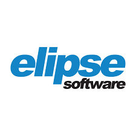

# Fala, mano 👋

## Técnico, tecnólogo, bacharel, especialista e curioso. 

### Conecte-se comigo:

### Linguagens
   
   
   
  
### Bancos de Dados
  
  
  
### Plataformas
   
  
### Ferramentas
   
  
  <a href="https://www.docker.com/" target="_blank" rel="noreferrer"> 
  <a href="http://elipse.com.br/" target="_blank" rel="noreferrer"> 
   

### Microcontroladores
   
   

  
  
  
  
   
   
  

